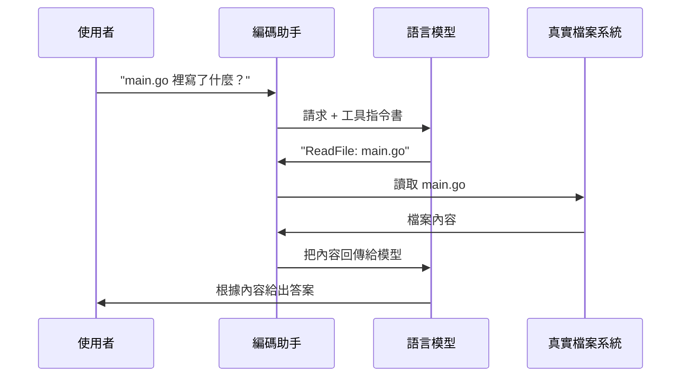

> 譯改寫自《Claude Code in Action》第 02 課

# 什麼是編碼助手？

> 📎 **本課資源**:[skilljar 原版課程頁(影片在此觀看,需登入)](https://anthropic.skilljar.com/claude-code-in-action/303235)

編碼助手不只是「幫你寫程式的工具」——它是一套以[[language-model|語言模型]]為核心、能夠處理複雜程式任務的系統。理解它在背後如何運作，才能看出什麼叫做真正強大的編碼夥伴。

---

## 編碼助手的工作流程

當你交給編碼助手一個任務（例如根據錯誤訊息修 Bug），它會像人類開發者一樣，依序做三件事：


| 步驟 | 說明 |
|------|------|
| **收集上下文** | 理解錯誤指向哪裡、哪些檔案受影響 |
| **制定計畫** | 決定如何解決，例如修改程式碼再跑測試驗證 |
| **採取行動** | 真正修改檔案、執行命令、完成修復 |

關鍵洞見：**第一步和最後一步都需要與外部世界互動**——讀檔案、查文件、執行命令、編輯程式碼。

---

## 語言模型的限制：只能處理文字

[[language-model|語言模型]]本身只能「吃文字、吐文字」，無法直接讀取本機檔案或執行指令。若直接問一個獨立語言模型「讀這個檔案」，它只會回你：「我沒有這個能力。」

那編碼助手是怎麼做到的？答案是：**[[tool-use|工具使用（Tool Use）]]**。

---

## 工具使用如何運作

[[tool-use|工具使用]]的機制很巧妙：編碼助手在把你的請求送給模型之前，會附上一份「指令書」，教模型如何表達「我想執行某個動作」。

### 完整流程



這套機制讓語言模型「看起來」能讀檔案、寫程式、跑命令——實際上它只是產生了格式化的文字回應，**真正執行動作的是編碼助手本身**。

---

## 為什麼 Claude 的工具使用特別強？

不是所有語言模型都擅長使用工具。[[claude|Claude]] 系列模型（[[claude-models|Opus、Sonnet、Haiku]]）在「理解工具、正確呼叫工具」方面尤其突出。

### 強工具使用帶來的三大好處

| 好處 | 說明 |
|------|------|
| **完成更難的任務** | [[claude]] 能組合多種工具，甚至使用從未見過的新工具 |
| **平台可擴展** | 可輕鬆為 [[claude-code]] 新增工具，Claude 會自適應你的流程 |
| **更好的安全性** | 無需索引整個程式碼庫即可導航，避免把原始碼送出去外部伺服器 |

---

## 本課重點回顧

- 編碼助手以[[language-model|語言模型]]為核心完成任務
- 語言模型需要[[tool-use|工具使用]]機制才能處理真實世界的程式問題
- 不同模型的工具使用能力差異很大
- [[claude|Claude]] 的工具使用能力提升了安全性、可客製化程度與長期可用性

> 正是這種工具使用能力，將一個只會產生文字的模型，轉變成能讀檔案、理解程式庫、並實際修改專案的強大編碼助手。

```glossary
{
  "language-model": {
    "term": "Language Model｜語言模型",
    "short": "以大量文字訓練的 AI 模型，只能接收文字輸入、產生文字輸出。它本身無法直接讀取檔案或執行指令，需要靠[[tool-use|工具使用]]機制與外部世界互動。",
    "deeper": "語言模型如何透過 token 預測來「理解」程式碼？這和人類閱讀程式碼有什麼本質差異？"
  },
  "tool-use": {
    "term": "Tool Use｜工具使用",
    "short": "一種讓[[language-model|語言模型]]能夠呼叫外部工具（如讀檔、執行命令）的機制。模型產生格式化的文字請求，編碼助手攔截後真正執行動作，再把結果回傳給模型。",
    "deeper": "如果模型沒有被訓練成善用工具，即使提供工具也不會正確呼叫——這就是為什麼不同模型的工具使用能力差異很大。"
  },
  "claude": {
    "term": "Claude｜Claude 模型",
    "short": "Anthropic 開發的 AI 模型系列，在工具使用能力上特別突出，是 [[claude-code|Claude Code]] 的核心引擎。",
    "deeper": "Claude 的工具使用能力為什麼比其他模型強？這和 Anthropic 的訓練方式有什麼關係？"
  },
  "claude-models": {
    "term": "Opus / Sonnet / Haiku｜Claude 模型系列",
    "short": "Claude 的三個層級：Opus 能力最強、Haiku 速度最快成本最低、Sonnet 在中間取得平衡。[[claude-code|Claude Code]] 依任務複雜度自動選用。",
    "deeper": "什麼樣的任務適合用 Opus？什麼時候 Haiku 就夠用了？"
  },
  "claude-code": {
    "term": "Claude Code｜Claude Code 工具",
    "short": "Anthropic 官方的 AI 編碼助手 CLI 工具，以[[claude|Claude]] 模型為核心，透過[[tool-use|工具使用]]機制讓模型能讀寫檔案、執行命令、操作 Git 等。",
    "deeper": "Claude Code 和一般聊天版 Claude 的最大差異是什麼？"
  }
}
```
