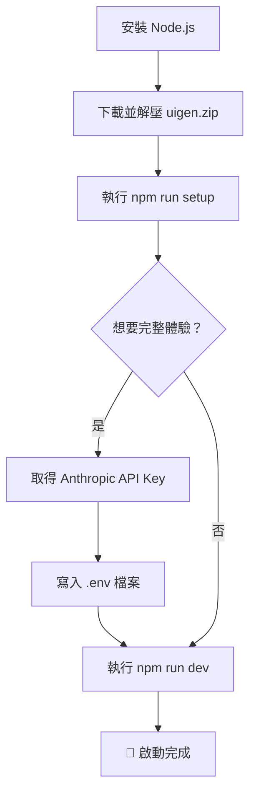

> 譯改寫自《Claude Code in Action》第 05 課

# 05｜專案準備 (Project Setup)

有一個可以動手操作的專案，會讓你在練習 [[claude-code]] 時更有感覺。

課程提供了一個小型範例專案 **uigen**（UI 生成應用），就是前面影片裡展示的那個。你不一定要用它——如果你有自己的程式碼庫，也可以跟著課程用自己的專案練習。

---

## 準備步驟



### 1. 安裝 Node.js

確保本機已安裝 Node.js：

- 安裝說明：[https://nodejs.org/en/download](https://nodejs.org/en/download)

### 2. 取得範例專案

下載本課附帶的 `uigen.zip`，解壓到你想要的目錄。

### 3. 安裝依賴並初始化資料庫

在專案目錄執行：

```bash
npm run setup
```

這個指令會自動安裝套件依賴，並初始化本地 [[sqlite]] 資料庫。

### 4. 設定 API Key（選用）

uigen 專案使用 [[anthropic-api]] 呼叫 Claude 來生成 UI 元件。

- **不設定**：仍可執行，但只會生成靜態假代碼（mock response）。
- **設定後**：可體驗完整的 AI 生成 UI 功能。

取得 API Key：[https://console.anthropic.com/](https://console.anthropic.com/)

將 API Key 寫入專案根目錄的 `.env` 檔案：

```
ANTHROPIC_API_KEY=sk-ant-xxxxxxxx
```

### 5. 啟動專案

```bash
npm run dev
```

---

## 備注

這一課的重點在**環境建置**，沒有特別的 Claude Code 功能介紹。後續課程才會開始介紹 [[claude-md]]、[[mcp-server]]、[[hook]] 等核心功能。先把環境準備好，接下來才能邊看邊動手試。

```glossary
{
  "claude-code": {
    "term": "Claude Code",
    "short": "Anthropic 官方的 AI 程式設計 CLI 工具，讓你在終端機直接與 Claude 協作寫程式。",
    "deeper": "Claude Code 和一般 AI 助理有什麼不同？它如何讀取你的程式碼庫？"
  },
  "sqlite": {
    "term": "SQLite",
    "short": "輕量級的嵌入式關聯式資料庫，不需要獨立的資料庫伺服器，直接以單一檔案存在專案裡。",
    "deeper": "什麼情境適合用 SQLite？什麼情境要換成 PostgreSQL？"
  },
  "anthropic-api": {
    "term": "Anthropic API",
    "short": "Anthropic 提供的 REST API，讓你的應用程式透過 HTTP 呼叫 Claude 模型來生成文字、程式碼或分析內容。",
    "deeper": "API Key 要如何安全管理？為什麼不能直接寫死在程式碼裡？"
  },
  "claude-md": {
    "term": "CLAUDE.md",
    "short": "放在專案根目錄的設定檔，用來告訴 Claude Code 這個專案的規則、慣例與背景知識。",
    "deeper": "CLAUDE.md 裡通常會寫什麼？如何讓 Claude 更了解你的專案？"
  },
  "mcp-server": {
    "term": "MCP Server (Model Context Protocol)",
    "short": "讓 Claude Code 連接外部工具或服務的標準協定，例如連接資料庫、瀏覽器或自訂 API。",
    "deeper": "MCP Server 和一般 API 有什麼差別？怎麼設定讓 Claude 使用它？"
  },
  "hook": {
    "term": "Hook (PreToolUse / PostToolUse)",
    "short": "Claude Code 的鉤子機制，讓你在 Claude 呼叫工具前（PreToolUse）或後（PostToolUse）執行自訂腳本，用來做驗證、日誌或自動化。",
    "deeper": "Hook 和 MCP Server 的差別是什麼？什麼場景適合用 Hook？"
  }
}
```
