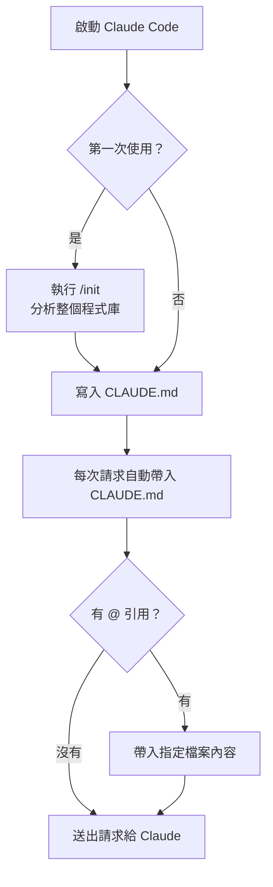

# 06. 新增上下文（Adding Context）

> 譯改寫自《Claude Code in Action》第 06 課

---

## 為什麼上下文管理很重要？

處理大型專案時，程式庫可能有幾十、甚至上百個檔案。Claude 只需要與當前任務**相關**的部分——提供過多無關上下文反而會降低表現。

學會引導 Claude 定位關鍵檔案與文件，是讓它高效運作的核心技能。

---

## `/init` 指令

在新專案第一次啟動 Claude Code 時，執行 [[slash-command|`/init`]] 指令。

Claude 會自動分析整個程式庫，理解：

- 專案目標與架構
- 關鍵指令與核心檔案
- 程式碼風格與慣例

分析完成後，Claude 會生成摘要並寫入 [[claude-md|`CLAUDE.md`]]。

> 當 Claude 詢問是否允許寫入時：
> - 按 `Enter` → 逐次確認每個寫入動作
> - 按 `Shift+Tab` → 授權 Claude 在本次 session 自由寫檔

---

## `CLAUDE.md` 是什麼？

[[claude-md]] 有兩個核心用途：

1. **引導 Claude 理解程式庫**：記錄重要指令、架構說明、程式碼風格
2. **放入自訂指令**：讓 Claude 每次啟動都照你的規則行事

這個檔案會**自動包含在每一次請求**中，相當於**專案級的持久系統提示詞**。

---

## `CLAUDE.md` 的三個位置

| 位置 | 用途 | 是否納入版控 |
|---|---|---|
| `CLAUDE.md`（專案根目錄） | 由 `/init` 生成，供團隊共用 | ✅ 提交到 repo |
| `CLAUDE.local.md`（專案根目錄） | 個人專用設定 | ❌ 加入 `.gitignore` |
| `~/.claude/CLAUDE.md`（家目錄） | 全域設定，適用本機所有專案 | ❌ 個人機器本地 |

---

## 新增自訂指令（記憶模式）

在對話中使用 `#` 開頭輸入指令，可進入「記憶模式」——Claude 會自動將這條指令合併進 [[claude-md]]。

**範例：**

```
# Use comments sparingly. Only comment complex code.
```

Claude 收到後，會把這條規則寫入 `CLAUDE.md`，之後每次對話都會遵守。

---

## 用 `@` 提及檔案

對話中想讓 Claude 參考某個特定檔案，用 [[at-mention|`@`]] 加上路徑即可。

**範例：**

```
How does the auth system work? @auth
```

Claude 會列出相關候選檔案供你選擇，選定後自動將檔案內容加入這次請求的上下文。

---

## 在 `CLAUDE.md` 裡固定引用檔案

如果某個檔案（例如資料庫 schema）在大多數任務都會用到，可以在 [[claude-md]] 裡直接用 [[at-mention]] 引用它：

```markdown
The database schema is defined in the @prisma/schema.prisma file.
Reference it anytime you need to understand the structure of data
stored in the database.
```

這樣每次請求都會**自動帶入**該檔案內容，不需要每次手動提及，也不需要 Claude 反覆搜尋。

---

## 上下文注入流程



---

```glossary
{
  "claude-md": {
    "term": "CLAUDE.md",
    "short": "放在專案根目錄的設定檔，自動包含在每次請求中，相當於專案級的持久系統提示詞。可記錄架構說明、慣例規則、自訂指令。",
    "deeper": "CLAUDE.md、CLAUDE.local.md、~/.claude/CLAUDE.md 三個位置各有什麼不同的適用場景？"
  },
  "slash-command": {
    "term": "Slash Command（斜線指令）",
    "short": "在 Claude Code 對話框中以 / 開頭的內建指令，例如 /init 用來初始化專案、分析程式庫並生成 CLAUDE.md。",
    "deeper": "Claude Code 還有哪些常用的 slash command？"
  },
  "at-mention": {
    "term": "@ Mention（@ 提及）",
    "short": "在對話或 CLAUDE.md 中用 @ 後接檔案路徑，讓 Claude 自動將該檔案內容加入請求的上下文。",
    "deeper": "在 CLAUDE.md 裡固定引用檔案，和每次對話臨時 @ 提及，有什麼效能或 token 成本上的差別？"
  }
}
```
