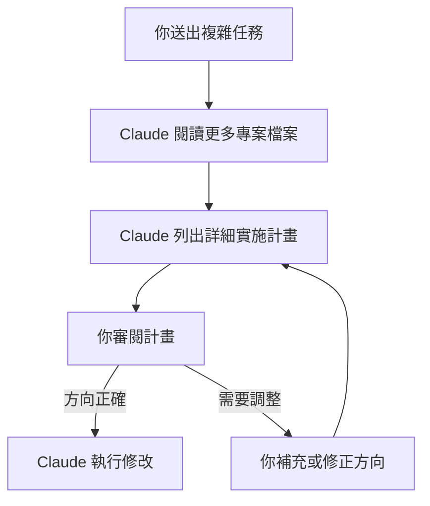

> 譯改寫自《Claude Code in Action》第 07 課

# 07. Making Changes｜進行修改

在開發環境中使用 Claude 時,你經常需要對現有專案進行修改。本課介紹兩大實用技巧:用截圖進行精準溝通,以及善用 Claude 的高階推理能力提升修改品質。

---

## 用截圖進行精準溝通

截圖是與 Claude 溝通 UI 修改需求最有效的方式之一。當你想修改介面某個細節時,截圖能讓 Claude 準確理解你指的具體區域。

將截圖貼入 Claude 時,請使用：

```
Ctrl+V   ← macOS 也是 Ctrl+V，不是 Cmd+V
```

貼上後就可以直接描述「修改這個部分」,Claude 會根據截圖精確定位。

---

## [[planning-mode|規劃模式（Planning Mode）]]

當任務比較複雜、需要在程式庫中大量探索時,可以啟用 [[planning-mode]]。它會讓 Claude **先深入瀏覽專案、再提出實施方案**,而不是直接動手修改。

### 如何啟用

按 `Shift + Tab` **兩次**即可啟用（若已開啟自動接受編輯，按**一次**即可）。

### 規劃模式的流程



### 規劃模式的優點

- 閱讀更多專案檔案,建立完整理解
- 給出詳細的實施計畫,明確說明將做的操作
- **在執行前等待你的批准**,減少誤操作

---

## [[thinking-mode|思考模式（Thinking Modes）]]

Claude 提供多個「思考」模式，讓它在複雜問題上投入更多推理資源。每個模式都會分配更多 [[token]]，用於更深層的分析與推理。

| 指令 | 強度 | 適用情境 |
|------|------|----------|
| `think` | 基礎推理 | 一般複雜問題 |
| `think more` | 擴展推理 | 需要多方考量 |
| `think a lot` | 深入推理 | 邏輯較複雜的任務 |
| `think longer` | 更長時間推理 | 演算法設計 |
| [[ultrathink]] | 最高強度推理 | 極度複雜/疑難排查 |

在對話框輸入這些關鍵字即可觸發對應模式。

---

## 規劃模式 vs 思考模式：怎麼選？

這兩者針對不同類型的複雜度：

**[[planning-mode|規劃模式]] 適合「廣度」問題：**
- 需要廣泛理解程式庫的任務
- 多步驟實施
- 涉及多個檔案或元件的改動

**[[thinking-mode|思考模式]] 適合「深度」問題：**
- 複雜邏輯問題
- 疑難 Bug 排查
- 演算法或推理挑戰

> **兩者可以同時使用。** 如果一個任務既需要「廣度」又需要「深度」，可同時啟用。但要注意，兩者都會消耗更多 [[token]]，因此會帶來成本。

---

```glossary
{
  "planning-mode": {
    "term": "Planning Mode / 規劃模式",
    "short": "按 Shift+Tab 兩次啟用。讓 Claude 先廣泛閱讀專案、列出實施計畫，等你確認後再執行，適合多檔案、多步驟的複雜任務。",
    "deeper": "規劃模式和思考模式的差別是什麼？各自適合哪種情境？"
  },
  "thinking-mode": {
    "term": "Thinking Modes / 思考模式",
    "short": "在對話中輸入 think / think more / think a lot / think longer / [[ultrathink]] 等關鍵字，讓 Claude 投入更多推理資源，適合複雜邏輯或疑難排查。",
    "deeper": "ultrathink 和 think a lot 的差異在哪？什麼時候值得用最高強度？"
  },
  "ultrathink": {
    "term": "Ultrathink",
    "short": "[[thinking-mode]] 的最高強度模式，消耗最多 [[token]]，適合極度複雜的問題或難以定位的 Bug。",
    "deeper": "使用 ultrathink 時，成本和效益的取捨要怎麼評估？"
  },
  "token": {
    "term": "Token / 詞元",
    "short": "Claude 處理文字的基本單位，約等於 0.75 個英文單字。每次對話消耗的 token 愈多，費用愈高；[[thinking-mode]] 和 [[planning-mode]] 都會額外消耗 token。"
  }
}
```
