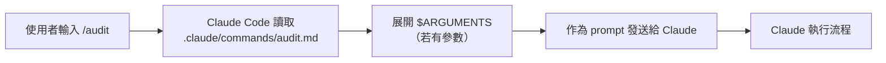

> 譯改寫自《Claude Code in Action》第 10 課

# 第 10 課｜自訂命令 Custom Commands

Claude Code 內建了一批以斜線開頭的命令（如 `/clear`、`/help`），你也可以建立自己的 [[custom-command|自訂命令]]，把重複流程自動化成一個 [[slash-command|斜線命令]]。

---

## 建立自訂命令

在你的專案裡準備以下目錄結構：

```
<project-root>/
└── .claude/
    └── commands/
        └── audit.md        ← 命令名稱 = 檔名
```

**三個步驟：**

1. 找到（或建立）專案根目錄下的 `.claude/` 目錄
2. 在其中建立 `commands/` 子目錄
3. 新增一個 Markdown 檔案，**檔名即命令名**

> ⚠️ 新增命令檔後需**重啟 Claude Code** 才會識別。

---

## 範例：npm 依賴稽核命令

建立 `.claude/commands/audit.md`，內容如下：

```markdown
1. 執行 npm audit 找出漏洞
2. 執行 npm audit fix 自動修復
3. 執行測試，確認修復沒有破壞功能
```

儲存後重啟，即可在對話中輸入 `/audit` 觸發這套流程。

---

## 帶參數的命令

自訂命令可以使用 [[arguments-placeholder|`$ARGUMENTS`]] 佔位符，讓命令接收使用者在斜線後輸入的任意文字，更具彈性。

**範例：`.claude/commands/write_tests.md`**

```
Write comprehensive tests for: $ARGUMENTS

Testing conventions:
* Use Vitest with React Testing Library
* Place test files in a __tests__ directory in the same folder as the source file
* Name test files as [filename].test.ts(x)
* Use @/ prefix for imports

Coverage:
* Test happy paths
* Test edge cases
* Test error states
```

**呼叫方式：**

```
/write_tests the use-auth.ts file in the hooks directory
```

`$ARGUMENTS` 會被替換為 `the use-auth.ts file in the hooks directory`，傳給 Claude 作為指令的一部分。參數可以是任意文字說明，不限定檔案路徑。

---

## 關鍵收益

| 收益 | 說明 |
|------|------|
| 自動化 | 把重複流程變成一個命令，不必每次手打 |
| 一致性 | 確保每次執行遵循相同步驟與慣例 |
| 上下文 | 在命令裡嵌入專案規範，Claude 不必靠 [[claude-md]] 推斷 |
| 彈性 | 透過 [[arguments-placeholder]] 適配不同場景 |

自訂命令非常適合專案內的固定流程，例如測試生成、部署、程式碼審查等。

---

## 架構示意



```glossary
{
  "custom-command": {
    "term": "Custom Command｜自訂命令",
    "short": "放在 .claude/commands/ 的 Markdown 檔，檔名即斜線命令名。重啟後可在對話中用 /命令名 觸發。",
    "deeper": "自訂命令和內建命令有什麼差異？能做什麼內建命令做不到的事？"
  },
  "slash-command": {
    "term": "Slash Command｜斜線命令",
    "short": "以 / 開頭的命令，Claude Code 看到後會去 .claude/commands/ 找對應的 Markdown 檔來執行。",
    "deeper": "斜線命令和直接在對話框輸入指令有什麼本質差異？"
  },
  "arguments-placeholder": {
    "term": "$ARGUMENTS｜參數佔位符",
    "short": "在命令 Markdown 裡寫 $ARGUMENTS，Claude Code 執行時會把使用者在斜線命令後輸入的文字替換進去，讓同一個命令可以作用在不同目標。",
    "deeper": "如果命令裡有多個 $ARGUMENTS，會怎麼處理？"
  },
  "claude-md": {
    "term": "CLAUDE.md",
    "short": "放在 .claude/ 或專案根目錄的 Markdown 檔，定義專案層級的規則與約定，每次對話 Claude 都會自動讀取。",
    "deeper": "CLAUDE.md 和自訂命令的 Markdown 有何分工？哪些內容適合放 CLAUDE.md、哪些適合做成命令？"
  }
}
```
