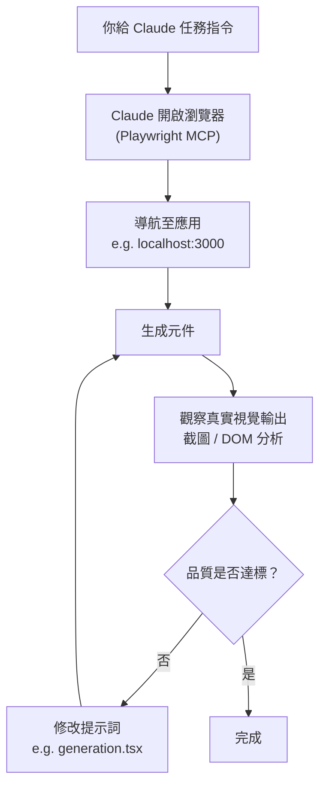

> 譯改寫自《Claude Code in Action》第 11 課

# MCP 伺服器 — 擴充 Claude Code 的能力邊界

[[mcp-server]] 讓你把 Claude Code 從「程式碼助手」升級為「全流程開發夥伴」。
伺服器可在**本機**或**遠端**執行，為 Claude 注入原本沒有的新工具與新能力。

---

## 為什麼需要 MCP 伺服器？

Claude Code 預設只能讀寫檔案、執行終端指令。但開發流程往往還需要：

- 控制瀏覽器、截圖、驗證 UI
- 與資料庫或雲端服務互動
- 呼叫外部 API

這些能力都能透過掛載不同的 [[mcp-server]] 取得。

---

## 安裝 Playwright MCP 伺服器

[[playwright-mcp]] 是最常用的 [[mcp-server]] 之一，讓 Claude 直接控制瀏覽器，大幅提升 Web 開發回饋速度。

在**終端機**（不是在 Claude Code 對話框內）執行：

```bash
claude mcp add playwright npx @playwright/mcp@latest
```

這條指令做了兩件事：

1. 把伺服器命名為 `playwright`
2. 指定本機啟動伺服器的指令（`npx @playwright/mcp@latest`）

---

## 權限管理

預設情況下，Claude 每次使用 [[mcp-server]] 工具都會彈出確認視窗。
若希望減少干擾，可在設定檔中預先允許：

```json
{
  "permissions": {
    "allow": ["mcp__playwright"],
    "deny": []
  }
}
```

注意：`mcp__playwright` 使用**雙底線** `__`（[[mcp-prefix]] 命名慣例）。
設定後 Claude 就能直接呼叫 Playwright 工具，無須每次確認。

---

## Playwright 的完整工作流程



Claude 能**看到真實視覺輸出**，而不只是盯著程式碼——這是 [[playwright-mcp]] 最大的優勢。

---

## 實戰範例：提升元件生成品質

向 Claude 下這樣的指令：

```
訪問 localhost:3000，生成一個基礎元件，
檢查樣式，然後更新 @src/lib/prompts/generation.tsx
裡的提示詞，讓後續元件設計更豐富。
```

**Claude 會自動完成：**

1. 開啟瀏覽器並進入應用
2. 生成測試元件
3. 分析視覺樣式與程式碼品質
4. 更新提示詞檔案
5. 重新測試新提示詞

### 升級前後對比

從「紫藍漸變 + 標準 Tailwind 結構」升級為：

- 暖色夕陽漸變（橙 → 粉 → 紫）
- 海洋深度主題（青綠 → 翡翠 → 青藍）
- 非對稱版面與重疊元素
- 更具創意的留白與結構

---

## MCP 生態系統

[[playwright-mcp]] 只是生態圈的一角，還有更多伺服器可選：

| 應用場景 | 範例 |
|---|---|
| 瀏覽器自動化 | [[playwright-mcp]] |
| 資料庫互動 | SQLite MCP、PostgreSQL MCP |
| API 測試與監控 | HTTP client MCP |
| 檔案系統操作 | Filesystem MCP |
| 雲端服務整合 | AWS、GCP MCP |
| 開發工具自動化 | GitHub MCP、Jira MCP |

根據專案需求挑選合適的 [[mcp-server]]，即可讓 Claude Code 深度融入整個開發流程。

```glossary
{
  "mcp-server": {
    "term": "MCP Server / MCP 伺服器",
    "short": "依 Model Context Protocol 規範實作的外掛程式，讓 Claude 取得額外工具（如瀏覽器、資料庫、API）。可在本機或遠端執行。",
    "deeper": "MCP 伺服器和 Claude Code 是透過什麼協定溝通的？本機伺服器和遠端伺服器有什麼差異？"
  },
  "playwright-mcp": {
    "term": "Playwright MCP / Playwright MCP 伺服器",
    "short": "讓 Claude 控制真實瀏覽器的 [[mcp-server]]。可自動導航、截圖、分析 DOM，使 Claude 能「看到」視覺輸出而非只讀程式碼。",
    "deeper": "Playwright MCP 和直接讓 Claude 讀取 HTML 相比，有什麼根本上的差異？"
  },
  "mcp-prefix": {
    "term": "mcp__ 前綴命名慣例",
    "short": "在 permissions 設定中，MCP 伺服器的工具名稱以 mcp__<伺服器名> 格式表示（雙底線）。例如 mcp__playwright 代表 playwright 伺服器下的所有工具。",
    "deeper": "如果只想允許某個 MCP 伺服器的特定工具，而非全部，要怎麼寫？"
  }
}
```
