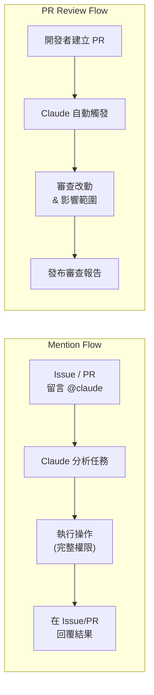

> 譯改寫自《Claude Code in Action》第 12 課

# GitHub 整合

> 📎 **本課資源**:[skilljar 原版課程頁(影片在此觀看,需登入)](https://anthropic.skilljar.com/claude-code-in-action/303240)

[[github-integration]] 讓 Claude Code 從「本機開發助手」升級成**團隊自動化成員**，直接在 GitHub 流程裡完成任務與程式碼審查。

---

## 安裝與初始設定

在本機 Claude 對話中執行 [[slash-command|斜線指令]] `/install-github-app`，它會自動引導你：

1. 安裝 [[github-app|Claude Code GitHub App]] 到你的 Repository
2. 設定 API Key（Anthropic API Key）
3. 自動產生一個 PR，內含兩個 [[github-actions|GitHub Actions]] 工作流程檔

合併該 PR 後，`.github/workflows/` 目錄中就會出現兩個 Action 設定檔。

---

## 兩種預設工作流程



### Mention Action（@claude 呼叫）

在任何 Issue 或 PR 留言中輸入 `@claude`，Claude 會：

- 分析你描述的任務並給出計畫
- 以完整權限執行操作（建立檔案、推 commit…）
- 將結果回覆在同一個 Issue / PR 討論串

### PR Review Action（自動審查）

每次有新 PR 建立時，Claude 自動：

- 審查所有程式碼改動
- 分析影響範圍與潛在風險
- 以留言形式發布詳細審查報告

---

## 自訂工作流程

合併初始 PR 之後，可依照專案需求調整 YAML 設定。

### 加入專案準備步驟

讓 Claude 執行前先完成環境設定：

```yaml
- name: Project Setup
  run: |
    npm run setup
    npm run dev:daemon
```

### 加入 [[custom-instructions|自訂指令]]

透過 `custom_instructions` 補充專案背景，讓 Claude 知道環境狀態：

```yaml
custom_instructions: |
  The project is already set up with all dependencies installed.
  The server is already running at localhost:3000. Logs from it
  are being written to logs.txt. If needed, you can query the
  db with the 'sqlite3' cli. If needed, use the mcp__playwright
  set of tools to launch a browser and interact with the app.
```

### 設定 [[mcp-server|MCP 伺服器]]

在 Actions 中掛載 MCP 工具（例如 Playwright）：

```yaml
mcp_config: |
  {
    "mcpServers": {
      "playwright": {
        "command": "npx",
        "args": [
          "@playwright/mcp@latest",
          "--allowed-origins",
          "localhost:3000;cdn.tailwindcss.com;esm.sh"
        ]
      }
    }
  }
```

---

## 工具權限設定

在 [[github-actions]] 環境中，**必須明確列出所有允許的工具**（包含 [[mcp-server]] 工具），沒有本機的「快速許可」機制：

```yaml
allowed_tools: "Bash(npm:*),Bash(sqlite3:*),mcp__playwright__browser_snapshot,mcp__playwright__browser_click,..."
```

> **重點**：與本機互動不同，Actions 中每個工具都要逐項列出，漏掉就無法使用。

---

## 最佳實踐

| 建議 | 說明 |
|------|------|
| 從預設工作流開始 | 先合併自動產生的 PR，不要從零手寫 |
| 用 [[custom-instructions]] 補脈絡 | 告訴 Claude 伺服器狀態、資料庫路徑等 |
| [[mcp-server]] 務必寫清權限 | [[allowed-tools]] 要逐項列出，否則 Claude 無法調用 |
| 先用簡單任務驗證 | 確認工作流通了，再交付複雜任務 |

---

```glossary
{
  "github-integration": {
    "term": "GitHub Integration｜GitHub 整合",
    "short": "Claude Code 官方提供的 GitHub 整合，讓 Claude 能在 GitHub Actions 裡自動執行任務與程式碼審查。",
    "deeper": "整合後 Claude 如何在無人值守的 CI 環境中保持安全性？"
  },
  "slash-command": {
    "term": "Slash Command｜斜線指令",
    "short": "在 Claude 對話框輸入 / 開頭的指令（如 /install-github-app），可觸發特定的自動化流程。",
    "deeper": "還有哪些常用的斜線指令？"
  },
  "github-app": {
    "term": "Claude Code GitHub App｜GitHub 應用程式",
    "short": "安裝到 GitHub Repository 後，讓 Claude 取得讀寫 Issues、PRs、程式碼的權限。",
    "deeper": "GitHub App 與 OAuth App 的權限管理有什麼差異？"
  },
  "github-actions": {
    "term": "GitHub Actions｜GitHub 自動化工作流程",
    "short": "GitHub 內建的 CI/CD 平台，Claude 透過它在雲端環境中執行任務（@claude 呼叫或 PR 審查）。",
    "deeper": "GitHub Actions 的執行環境與本機有什麼主要差異？"
  },
  "mcp-server": {
    "term": "MCP Server｜模型上下文協定伺服器",
    "short": "提供 Claude 額外工具能力的外掛伺服器（如 Playwright 瀏覽器自動化），需在設定中明確宣告。",
    "deeper": "在 GitHub Actions 中掛載 MCP Server 與本機有何不同？"
  },
  "custom-instructions": {
    "term": "Custom Instructions｜自訂指令",
    "short": "在 GitHub Actions YAML 的 custom_instructions 欄位補充專案背景（如已安裝的依賴、伺服器狀態），讓 Claude 不必重新探索環境。",
    "deeper": "custom_instructions 和 CLAUDE.md 的功能有什麼重疊或差異？"
  },
  "allowed-tools": {
    "term": "Allowed Tools｜允許工具清單",
    "short": "GitHub Actions 中必須明確列出 Claude 可使用的工具（包含 MCP 工具），未列出的工具一律無法調用。",
    "deeper": "為什麼 Actions 環境沒有本機的「快速許可」機制？"
  }
}
```
