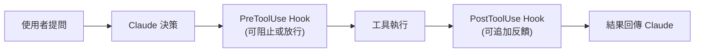

> 譯改寫自《Claude Code in Action》第 13 課

# 認識 Hooks — 讓 Claude Code 在工具執行前後插入你的邏輯

[[hook]] 讓你在 Claude 使用工具的前後，執行自訂命令。常見用途：編輯後自動格式化、自動跑測試、阻止存取敏感檔案。

---

## Hooks 如何插入工具流程

正常流程是：使用者提問 → Claude 決定使用工具 → [[claude-code]] 執行工具 → 結果回傳模型。

[[hook]] 就是插在這個流程的「攔截點」：



Hook 分兩類：

| 類型 | 觸發時機 | 能否阻止工具執行 |
|------|----------|----------------|
| [[pre-tool-use]] | 工具執行**前** | ✅ 可以 |
| [[post-tool-use]] | 工具執行**後** | ❌ 不行 |

---

## Hook 寫在哪裡

Hook 設定寫在 `settings.json`，有三個層級：

| 層級 | 路徑 | 說明 |
|------|------|------|
| 全域 | `~/.claude/settings.json` | 影響所有專案 |
| 專案（共享） | `.claude/settings.json` | 納入版控，團隊共用 |
| 專案（個人） | `.claude/settings.local.json` | 本機個人設定，不提交 |

也可以在 Claude Code 內輸入 `/hooks` [[slash-command]] 進行互動式設定。

---

## PreToolUse 設定範例

在工具執行**前**觸發，可以允許或阻止操作：

```json
"PreToolUse": [
  {
    "matcher": "Read",
    "hooks": [
      {
        "type": "command",
        "command": "node /home/hooks/read_hook.ts"
      }
    ]
  }
]
```

- `matcher`：指定要攔截的工具名稱（此例為 `Read`）
- Hook 腳本可選擇**放行**（讓工具正常執行）或**阻止**（回傳錯誤訊息給 Claude）

---

## PostToolUse 設定範例

在工具執行**後**觸發，無法阻止執行，但可以追加反饋：

```json
"PostToolUse": [
  {
    "matcher": "Write|Edit|MultiEdit",
    "hooks": [
      {
        "type": "command",
        "command": "node /home/hooks/edit_hook.ts"
      }
    ]
  }
]
```

- `matcher` 支援 `|` 串聯多個工具名稱
- 適合在寫入/編輯後，自動跑格式化、測試或 linter，並把結果回饋給 Claude

---

## 常見應用場景

- **程式碼格式化**：編輯後自動 `prettier` / `gofmt`
- **自動測試**：檔案異動後跑單元測試
- **存取控制**：阻止讀寫敏感檔案（如 `.env`、憑證）
- **程式碼品質**：執行 [[linter]] 或型別檢查並回饋結果
- **日誌記錄**：追蹤 Claude 存取過哪些檔案
- **規則校驗**：強制命名慣例或編碼規範

---

## 小結

[[pre-tool-use]] 給你**控制權**（可以擋住不想讓 Claude 做的操作）；[[post-tool-use]] 讓你**強化結果**（自動化後續處理並把反饋送回 Claude）。兩者合用，能把你的工具鏈無縫整合進 Claude Code 的工作流程。

```glossary
{
  "hook": {
    "term": "Hook（鉤子）",
    "short": "在 Claude Code 執行工具的前後，插入自訂命令的機制。分為 [[pre-tool-use]] 和 [[post-tool-use]] 兩類。",
    "deeper": "Hook 的設定寫在 settings.json 的哪個層級？各層級有什麼差異？"
  },
  "pre-tool-use": {
    "term": "PreToolUse Hook",
    "short": "工具執行**前**觸發的 hook，可以選擇放行或阻止工具執行，並向 Claude 回傳錯誤訊息。",
    "deeper": "什麼情境下你會用 PreToolUse 阻止工具執行？"
  },
  "post-tool-use": {
    "term": "PostToolUse Hook",
    "short": "工具執行**後**觸發的 hook，無法阻止執行，但可把額外反饋（如格式化結果、測試輸出）送回給 Claude。",
    "deeper": "PostToolUse 和 PreToolUse 的最大差異是什麼？"
  },
  "claude-code": {
    "term": "Claude Code",
    "short": "Anthropic 推出的 AI 程式設計助理 CLI 工具，可直接在終端機與 Claude 互動並操作程式碼。",
    "deeper": "Claude Code 與一般聊天介面的 Claude 有何不同？"
  },
  "slash-command": {
    "term": "Slash Command（斜線指令）",
    "short": "在 Claude Code 對話中輸入 `/` 開頭的指令，例如 `/hooks` 可進入 hook 互動式設定介面。",
    "deeper": "除了 /hooks，Claude Code 還有哪些常用 slash command？"
  },
  "linter": {
    "term": "Linter（程式碼檢查器）",
    "short": "靜態分析工具，自動檢查程式碼風格、潛在錯誤或違反規範之處，例如 ESLint（JavaScript）或 Ruff（Python）。",
    "deeper": "為什麼在 PostToolUse Hook 裡跑 linter 比手動跑更有效率？"
  }
}
```
