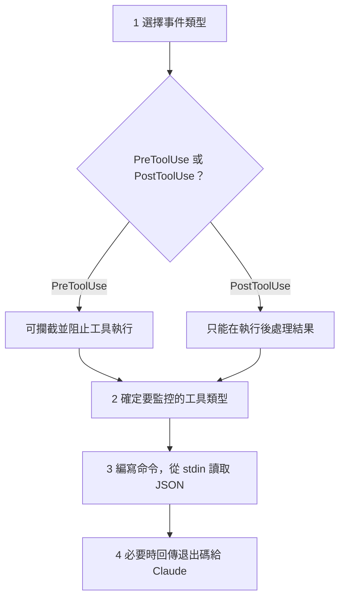

> 譯改寫自《Claude Code in Action》第 14 課

[[hook|Hook]] 讓你在工具呼叫前後攔截並控制 Claude 的行為，對開發環境擁有更細粒度的掌控。

---

## 一、什麼是 Hook？

[[hook|Hook]] 是一種「攔截鉤子」，允許你在 Claude 呼叫工具之前（[[pre-tool-use|PreToolUse]]）或之後（[[post-tool-use|PostToolUse]]）插入自訂邏輯，例如阻止讀取敏感檔案、記錄操作日誌，或在工具執行後進行額外處理。

---

## 二、建立 Hook 的四個步驟



1. **選擇 [[pre-tool-use]] 或 [[post-tool-use]]**：前者可阻止工具執行，後者只能在執行後處理
2. **確定要監控的工具類型**：明確指定哪些工具會觸發此 Hook
3. **編寫接收工具呼叫的命令**：透過標準輸入（stdin）取得 JSON 資料
4. **必要時向 Claude 反饋**：用 [[exit-code|退出碼]] 控制允許或阻止

---

## 三、可用工具

可用工具會隨著 [[mcp-server|MCP Server]] 的掛載而改變，因此可直接請 Claude 列出當前工具清單以確認。

---

## 四、工具呼叫的資料結構

Hook 命令從 stdin 讀取以下 JSON：

```json
{
  "session_id": "2d6a1e4d-6...",
  "transcript_path": "/Users/sg/...",
  "hook_event_name": "PreToolUse",
  "tool_name": "Read",
  "tool_input": {
    "file_path": "/code/queries/.env"
  }
}
```

- `hook_event_name`：事件類型（`PreToolUse` / `PostToolUse`）
- `tool_name`：被呼叫的工具名稱
- `tool_input`：工具的輸入參數，例如 `file_path`

Hook 命令讀取此 JSON 後，決定是否允許當前工具呼叫繼續執行。

---

## 五、退出碼與控制邏輯

| 退出碼 | 效果 |
|--------|------|
| `0` | 允許工具正常執行 |
| `2` | 阻止工具執行（僅 [[pre-tool-use]] 有效） |

若在 [[pre-tool-use|PreToolUse]] Hook 中返回退出碼 `2`，寫入 stderr 的內容會被 Claude 當作反饋訊息——可用來說明為何被攔截，讓 Claude 理解限制並調整行為。

---

## 六、常見應用範例

最常見的用途是**阻止 Claude 讀取敏感檔案**，例如 `.env`。

由於 `Read` 和 `Grep` 都可能存取檔案內容，你需要同時監控這兩個工具，並偵測是否指向敏感路徑。這樣既能保護檔案系統，又能清楚告訴 Claude 為何被攔截。

```bash
# 範例邏輯：阻止讀取 .env 的 PreToolUse Hook
# 1. 從 stdin 讀取 JSON
# 2. 解析 tool_input.file_path
# 3. 若路徑包含 .env → 印出原因到 stderr，exit 2
# 4. 否則 exit 0（允許繼續）
```

```glossary
{
  "hook": {
    "term": "Hook / 鉤子",
    "short": "在 Claude 工具呼叫前後插入的自訂攔截邏輯，可用於保護敏感資源或記錄操作。",
    "deeper": "PreToolUse 和 PostToolUse 有什麼差別？各適合用在什麼場景？"
  },
  "pre-tool-use": {
    "term": "PreToolUse",
    "short": "工具執行「之前」觸發的 [[hook]] 事件，可以透過退出碼 2 阻止工具繼續執行。",
    "deeper": "如果阻止了一個工具，Claude 會怎麼反應？"
  },
  "post-tool-use": {
    "term": "PostToolUse",
    "short": "工具執行「之後」觸發的 [[hook]] 事件，只能處理結果，無法回頭阻止執行。"
  },
  "exit-code": {
    "term": "Exit Code / 退出碼",
    "short": "Shell 命令結束時回傳的數字。Hook 用 0 表示允許、2 表示阻止（PreToolUse 限定）。"
  },
  "mcp-server": {
    "term": "MCP Server",
    "short": "Model Context Protocol Server — 提供額外工具給 Claude 使用的服務，掛載後可用工具清單會增加。",
    "deeper": "MCP Server 和 Hook 如何搭配使用？"
  }
}
```
