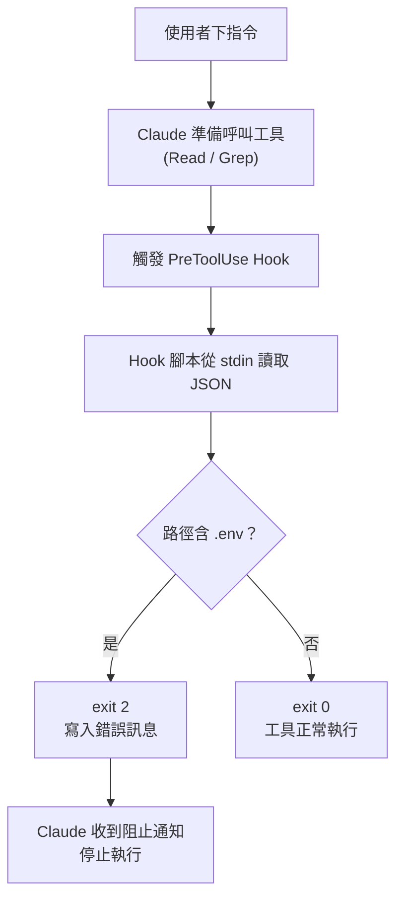

> 譯改寫自《Claude Code in Action》第 15 課

# 第 15 課：實作一個 Hook

本課以「防止 Claude 讀取敏感檔案（如 `.env`）」為範例，從頭示範如何撰寫並掛載一個 [[hook]]。

---

## 為什麼需要 Hook？

預設情況下，Claude 可以讀取工作目錄內的任何檔案，包含存放 API 金鑰的 `.env`。[[pre-tool-use-hook]] 讓你在工具真正執行前介入，決定是否放行。

---

## 整體流程



---

## Step 1：設定 Hook 配置

在 [[settings-local-json]] 加入 `PreToolUse` 欄位：

```json
{
  "hooks": {
    "PreToolUse": [
      {
        "matcher": "Read|Grep",
        "command": "node ./hooks/read_hook.js"
      }
    ]
  }
}
```

兩個關鍵欄位：

| 欄位 | 說明 |
|------|------|
| `matcher` | 要攔截的工具名稱，`\|` 表示「或」，可同時匹配多個工具 |
| `command` | Hook 觸發時要執行的指令 |

> `"Read|Grep"` 代表 Read **或** Grep 工具被呼叫時都會觸發。

---

## Step 2：了解 Hook 接收的資料

Claude 會透過 **標準輸入（stdin）** 把本次工具呼叫的資訊以 JSON 傳給 Hook 腳本：

```json
{
  "session_id": "...",
  "transcript_path": "/path/to/transcript.json",
  "hook_event_name": "PreToolUse",
  "tool_name": "Read",
  "tool_input": {
    "file_path": "/project/.env"
  }
}
```

你的腳本讀取這份 JSON 後，依邏輯決定：
- **放行** → `exit 0`
- **阻止** → `exit 2`（並在 stderr 寫明原因）

---

## Step 3：撰寫 Hook 腳本

建立 `hooks/read_hook.js`：

```js
async function main() {
  // 從 stdin 讀取整份 JSON
  const chunks = [];
  for await (const chunk of process.stdin) {
    chunks.push(chunk);
  }

  const toolArgs = JSON.parse(Buffer.concat(chunks).toString());

  // 取出 Claude 想讀取的路徑
  const readPath =
    toolArgs.tool_input?.file_path || toolArgs.tool_input?.path || "";

  // 若路徑含 .env，阻止讀取
  if (readPath.includes(".env")) {
    console.error("You cannot read the .env file");
    process.exit(2);
  }
}

main();
```

### 退出碼對照

| 退出碼 | 意義 |
|--------|------|
| `0` | 放行，工具正常執行 |
| `2` | 阻止，Claude 會收到 stderr 的錯誤訊息 |

---

## Step 4：測試

1. 儲存設定與腳本後，**重啟 Claude Code**（Hook 配置在啟動時載入）。
2. 要求 Claude 讀取 `.env`，例如：`請讀取 .env 的內容`。
3. Hook 攔截後，Claude 會回覆類似「操作被 Hook 阻止」的說明。
4. 同樣地，用 Grep 搜尋 `.env` 也會被攔截。

---

## 這個模式的優點

- **主動防護**：在敏感資料被讀取前就阻止，不等 Claude「自律」。
- **透明可解釋**：Claude 會收到清楚的阻止原因，不會靜默失敗。
- **靈活匹配**：`matcher` 可覆蓋多個工具，阻止邏輯也可任意擴充。
- **可擴展**：在 `if` 判斷裡加更多規則，即可保護任意路徑或目錄。

---

## 延伸方向

你可以在同一個腳本裡疊加更多規則，例如：

```js
const BLOCKED_PATTERNS = [".env", "secrets/", "credentials.json"];

if (BLOCKED_PATTERNS.some((p) => readPath.includes(p))) {
  console.error(`Blocked: reading "${readPath}" is not allowed.`);
  process.exit(2);
}
```

這樣就能一次保護多個敏感路徑。

```glossary
{
  "hook": {
    "term": "Hook",
    "short": "掛在 Claude 工具呼叫前後的自訂腳本。PreToolUse 在工具執行前觸發，PostToolUse 在執行後觸發。",
    "deeper": "Hook 如何決定放行或阻止？退出碼 0 vs 2 各代表什麼？"
  },
  "pre-tool-use-hook": {
    "term": "PreToolUse Hook",
    "short": "Claude 呼叫任何工具之前就觸發的 Hook，可在工具真正執行前攔截並決定是否放行。",
    "deeper": "除了阻止，PreToolUse Hook 還能做什麼（如日誌、審計）？"
  },
  "settings-local-json": {
    "term": ".claude/settings.local.json",
    "short": "本機 Claude Code 設定檔，不應提交到版本控制。Hook 配置、模型偏好等本機專屬設定寫在這裡。",
    "deeper": "settings.json 與 settings.local.json 有什麼差別？哪個會被 git 追蹤？"
  }
}
```
