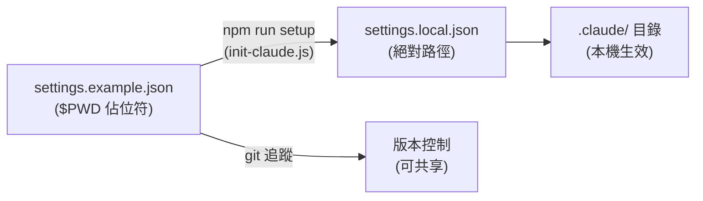

> 譯改寫自《Claude Code in Action》第 16 課

# 16. Hooks 常見坑點 (Gotchas Around Hooks)

---

## 為什麼 `.claude/` 裡會有兩個 `settings.json`？

執行 `npm run dev` 後，你可能會發現 `.claude/` 目錄下同時出現兩個設定檔。原因和 [[hook]] 的**路徑安全建議**有關。

---

## 絕對路徑 vs. 可分享性的矛盾

[[claude-code]] 官方文件對 [[hook]] 的安全使用有以下建議：

- **腳本盡量使用絕對路徑**，而非相對路徑。
- 這可以降低[路徑攔截](https://attack.mitre.org/techniques/T1574/007/)或[二進位植入](https://owasp.org/www-community/attacks/Binary_planting)的風險。

然而，絕對路徑有個明顯缺點：**你機器上的路徑和別人的完全不同**，沒辦法直接把 `settings.json` 放進 git 共享。

---

## 解法：`settings.example.json` + `$PWD` 佔位符

專案提供了一個 `settings.example.json`，其中的腳本路徑使用 `$PWD` 作為佔位符：

```json
{
  "hooks": {
    "PreToolUse": [
      {
        "matcher": "Bash",
        "hooks": [
          {
            "type": "command",
            "command": "$PWD/scripts/my-hook.sh"
          }
        ]
      }
    ]
  }
}
```

當你執行 `npm run setup` 時，`scripts/init-claude.js` 會自動完成以下三件事：

1. 將 `$PWD` 替換為**本機專案的絕對路徑**
2. 將 `settings.example.json` 複製一份
3. 重新命名為 `settings.local.json`



這樣就能**同時滿足**兩個需求：

| 需求 | 做法 |
|------|------|
| 安全性（絕對路徑） | `settings.local.json` 寫入本機絕對路徑 |
| 可共享性 | `settings.example.json` 用 `$PWD` 佔位、放進 git |

---

## 小結

這課的核心坑點只有一個：**[[hook]] 腳本絕對路徑難以共享**。解法是用 `$PWD` 佔位符 + 本機 setup 腳本自動替換，讓安全性和協作都兼顧。

```glossary
{
  "hook": {
    "term": "Hook",
    "short": "Claude Code 在工具呼叫前後自動執行的腳本鉤子，分 PreToolUse 與 PostToolUse 兩種時機。",
    "deeper": "Hook 可以攔截或觀察 Claude 的工具呼叫，例如在 Bash 指令執行前先做安全檢查，或在結束後自動記錄日誌。"
  },
  "claude-code": {
    "term": "Claude Code",
    "short": "Anthropic 官方的 AI 輔助編碼 CLI 工具，支援 Hooks、MCP、slash command 等擴充機制。"
  }
}
```
