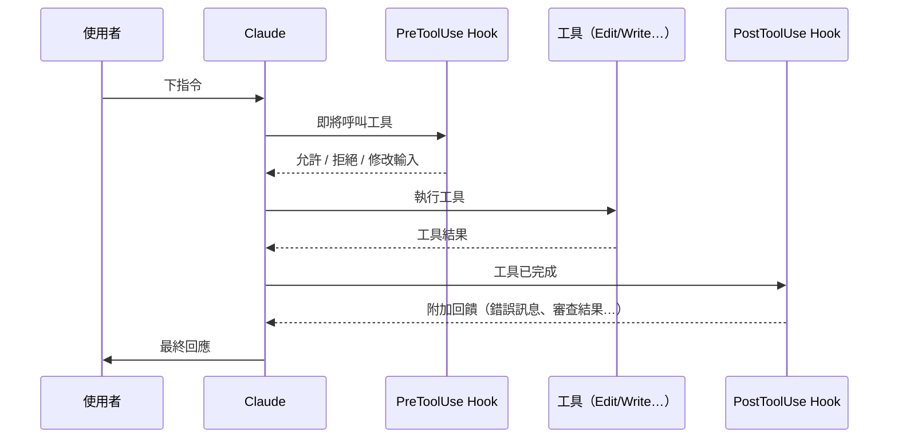
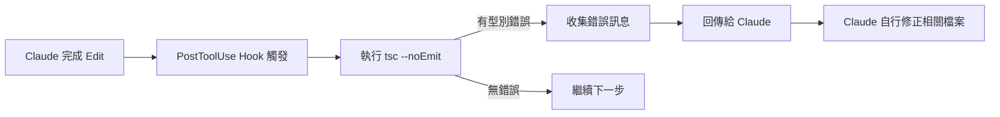
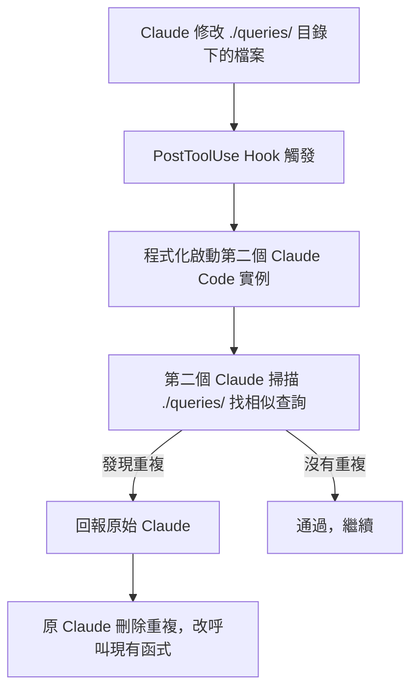

> 譯改寫自《Claude Code in Action》第 17 課

# 17. 實用的 [[hook|Hooks]]

[[claude-code|Claude Code]] 的 [[hook|Hooks]] 機制能補上 AI 協作的常見痛點，尤其在大型專案中效果顯著。它們在 Claude 修改程式碼時**自動執行**，提供即時回饋並阻止常見錯誤的累積。

---

## Hooks 的運作位置

[[hook|Hooks]] 分兩個觸發點插入工具呼叫的生命週期：



- **[[pre-tool-use|PreToolUse]]**：工具執行「前」介入，可擋下或修改請求。
- **[[post-tool-use|PostToolUse]]**：工具執行「後」介入，可注入回饋讓 Claude 自我修正。

---

## 實例一：TypeScript 型別檢查 Hook

### 問題

Claude 修改函式簽章時，常忘記更新所有呼叫點。例如：在 `schema.ts` 為函式加了 `verbose` 參數，但 `main.ts` 的呼叫仍沿用舊簽章，導致型別錯誤悄悄堆積。

### 解法：PostToolUse + tsc

每次 Claude 完成一次編輯，自動跑 TypeScript 編譯器：



**Hook 核心邏輯（示意）**

```bash
# PostToolUse 腳本範例
tsc --noEmit 2>&1 | head -50
# 把輸出寫進 Hook 回傳 JSON，Claude 會讀到錯誤並修正
```

**適用範圍**
- **強型別語言**（TypeScript、Go、Rust…）→ 跑編譯器 / [[linter|Linter]]。
- **弱型別語言**（Python、JavaScript…）→ 改用自動化測試或 lint。

---

## 實例二：防止重複查詢 Hook

### 問題

大型專案有大量資料庫查詢函式。當你要求 Claude 「加一個超過三天未處理訂單的 Slack 提醒」，它可能直接新寫一條 SQL，而不是復用現有的 `getPendingOrders()`，造成重複邏輯四散。

### 解法：PostToolUse + 第二個 Claude 實例審查



這個模式使用 [[typescript-sdk|TypeScript SDK]] 以程式化方式啟動另一個 Claude 實例，讓「一個 Claude 審查另一個 Claude 的輸出」。

---

## 實作取捨

| 面向 | TypeScript 型別檢查 Hook | 重複查詢 Hook |
|------|--------------------------|---------------|
| 資源消耗 | 低（只跑編譯器） | 高（啟動額外 Claude 實例） |
| 速度 | 快 | 慢 |
| 收益 | 型別安全、即時報錯 | 減少重複邏輯、提升一致性 |

**建議**：只監控**高價值目錄**（如 `./queries/`、`./src/types/`），避免對每個檔案都觸發高成本 Hook。

---

## 可延伸的思路

- 用編譯器 / [[linter|Linter]] 輸出做即時回饋。
- 用獨立 AI 實例做自動程式碼審查（[[typescript-sdk|TypeScript SDK]] 的程式化呼叫）。
- 重點監控高價值目錄，控制成本。
- 衡量**自動化收益 vs. 效能成本**，選擇性開啟。

> **核心原則**：找出你工作流程的痛點，設計 [[hook|Hook]] 自動解決它。

---

```glossary
{
  "hook": {
    "term": "Hook（鉤子）",
    "short": "Claude Code 的自動化插入點，可在工具執行前（[[pre-tool-use]]）或後（[[post-tool-use]]）觸發自訂腳本，用來驗證、回饋或攔截 Claude 的動作。",
    "deeper": "Hook 和 CLAUDE.md 的差異是什麼？Hook 何時比 CLAUDE.md 指令更適合？"
  },
  "pre-tool-use": {
    "term": "PreToolUse Hook",
    "short": "工具被呼叫「之前」觸發的 Hook，可以攔截請求、修改輸入，甚至拒絕執行。",
    "deeper": "PreToolUse 可以用來做哪些安全防護？"
  },
  "post-tool-use": {
    "term": "PostToolUse Hook",
    "short": "工具執行「完成後」觸發的 Hook，最常用來把編譯錯誤、lint 結果等回傳給 Claude 讓它自我修正。",
    "deeper": "PostToolUse 的回傳內容格式是什麼？Claude 怎麼讀取它？"
  },
  "claude-code": {
    "term": "Claude Code",
    "short": "Anthropic 推出的 AI 程式碼助理 CLI 工具，可直接在終端機操作、讀寫檔案、執行指令，並透過 Hooks 與 SDK 高度客製化。",
    "deeper": "Claude Code 和一般 ChatGPT 型助理的最大差異是什麼？"
  },
  "typescript-sdk": {
    "term": "TypeScript SDK（@anthropic-ai/sdk）",
    "short": "Anthropic 官方的 TypeScript/Node.js 函式庫，讓你以程式化方式呼叫 Claude API，也是實作進階 Hook（如啟動第二個 Claude 實例審查）的基礎工具。",
    "deeper": "用 SDK 程式化啟動 Claude 與直接在 CLI 下指令有什麼不同？"
  },
  "linter": {
    "term": "Linter（靜態分析工具）",
    "short": "在不執行程式的情況下掃描原始碼找出潛在錯誤或風格問題的工具，例如 ESLint（JS/TS）、Ruff（Python）、golangci-lint（Go）。",
    "deeper": "Linter 和型別檢查器（tsc）的職責有什麼不同？"
  }
}
```
