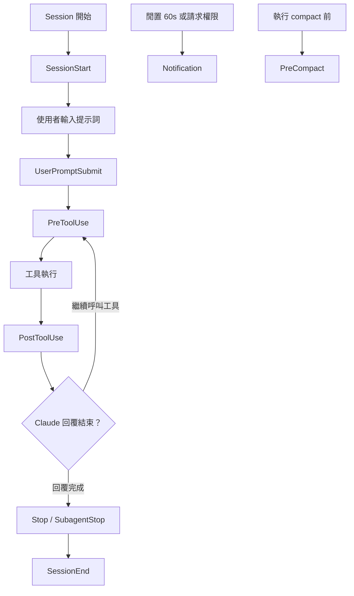

> 譯改寫自《Claude Code in Action》第 18 課

# 第 18 課：更多實用的 [[hook|Hook]] 類型

## Hook 全家桶

除了 [[pre-tool-use|PreToolUse]] 和 [[post-tool-use|PostToolUse]]，Claude Code 還提供以下 [[hook|Hook]] 事件：

| Hook 名稱 | 觸發時機 |
|---|---|
| `Notification` | Claude 請求工具權限，或閒置 60 秒時 |
| `Stop` | Claude 回覆結束時 |
| `SubagentStop` | 子代理任務結束時 |
| `PreCompact` | compact 操作前 |
| `UserPromptSubmit` | 使用者提交提示詞時 |
| `SessionStart` | 會話開始或恢復時 |
| `SessionEnd` | 會話結束時 |

## Hook 生命週期



## 最大的陷阱：每個 Hook 的 stdin 結構不同

不同 [[hook|Hook]] 的 [[stdin|標準輸入]] 結構**完全不同**，而且 [[pre-tool-use|PreToolUse]] / [[post-tool-use|PostToolUse]] 的格式還會隨工具類型變化——這讓撰寫穩定的 Hook 腳本變得困難。

### 範例一：PostToolUse（監聽 TodoWrite）

```json
{
  "session_id": "9ecf22fa-edf8-4332-ae85-b6d5456eda64",
  "transcript_path": "<path_to_transcript>",
  "hook_event_name": "PostToolUse",
  "tool_name": "TodoWrite",
  "tool_input": {
    "todos": [{ "content": "write a readme", "status": "pending", "priority": "medium", "id": "1" }]
  },
  "tool_response": {
    "oldTodos": [],
    "newTodos": [{ "content": "write a readme", "status": "pending", "priority": "medium", "id": "1" }]
  }
}
```

### 範例二：[[stop-hook|Stop Hook]]

```json
{
  "session_id": "af9f50b6-f042-4773-b3e2-c3a4814765ce",
  "transcript_path": "<path_to_transcript>",
  "hook_event_name": "Stop",
  "stop_hook_active": false
}
```

兩者欄位差異極大：PostToolUse 有 `tool_name`、`tool_input`、`tool_response`；[[stop-hook|Stop Hook]] 只有 `stop_hook_active`。不看文件就動手寫，很容易取到 `undefined`。

## 解法：先用記錄器 Hook 觀察真實格式

在正式撰寫 Hook 腳本前，先掛一個「記錄器」，把實際收到的 [[stdin|stdin]] 傾印成檔案：

```jsonc
// settings.json（以 PostToolUse 為例，其他 Hook 類型同理）
"PostToolUse": [
  {
    "matcher": "*",
    "hooks": [
      {
        "type": "command",
        "command": "jq . > post-log.json"
      }
    ]
  }
]
```

[[jq]] 的 `jq .` 指令會把 [[stdin|stdin]] 原樣格式化輸出，搭配 `>` 重導向存進 `post-log.json`。觀察這份 JSON 後，你就清楚知道有哪些欄位可用，再寫出穩定的 [[hook|Hook]] 腳本。

> **技巧**：[[matcher|matcher]] 設為 `"*"` 可攔截所有工具；確認欄位結構後，再改成特定工具名稱（如 `"Bash"` 或 `"TodoWrite"`）。

```glossary
{
  "hook": {
    "term": "Hook / 掛鉤",
    "short": "在 Claude Code 特定事件自動執行的外部命令，設定在 settings.json 裡。常見事件有工具呼叫前後、回覆結束、會話開始等。",
    "deeper": "Hook 能攔截並阻止工具執行嗎？"
  },
  "pre-tool-use": {
    "term": "PreToolUse",
    "short": "工具執行「之前」觸發的 Hook，可用來審查或阻斷工具呼叫。",
    "deeper": "PreToolUse 如何傳回阻斷訊號？"
  },
  "post-tool-use": {
    "term": "PostToolUse",
    "short": "工具執行「之後」觸發的 Hook，可用來記錄結果或觸發後續動作。"
  },
  "stop-hook": {
    "term": "Stop Hook",
    "short": "Claude 完成這一輪回覆時觸發。stdin 裡有 stop_hook_active 欄位，可據此決定是否繼續執行。",
    "deeper": "stop_hook_active 為 true 和 false 各代表什麼情境？"
  },
  "stdin": {
    "term": "stdin / 標準輸入",
    "short": "Hook 腳本從作業系統管道接收到的 JSON 資料，包含 session_id、hook_event_name 等欄位；不同 Hook 類型的欄位完全不同。"
  },
  "jq": {
    "term": "jq",
    "short": "命令列 JSON 處理工具。jq . 代表「原樣美化輸出」，搭配 > 重導向可把 stdin 存成 JSON 檔案。",
    "deeper": "jq 除了格式化輸出，還能做哪些過濾或轉換？"
  },
  "matcher": {
    "term": "matcher / 匹配器",
    "short": "Hook 設定裡指定「攔截哪些工具」的欄位。\"*\" 攔截全部，也可填特定工具名稱如 \"Bash\" 或 \"TodoWrite\"。"
  }
}
```
