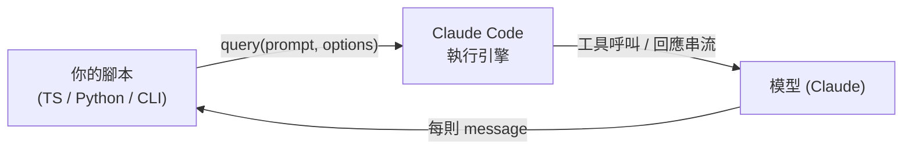

> 譯改寫自《Claude Code in Action》第 19 課

# 19. [[claude-code-sdk|Claude Code SDK]]

> 📎 **本課資源**:[skilljar 原版課程頁(影片在此觀看,需登入)](https://anthropic.skilljar.com/claude-code-in-action/312001)

[[claude-code-sdk]] 讓你可以在應用程式或腳本中，以程式化方式呼叫 Claude Code。
它提供 [[typescript]]、Python 以及 CLI 三種介面，功能與在終端機直接使用的 Claude Code 完全一致，適合自動化與系統整合場景。

---

## 關鍵特性

| 特性 | 說明 |
|---|---|
| 程式化呼叫 | 用程式碼驅動 Claude Code，不需手動互動 |
| 功能對等 | 與終端機版本具備同樣的完整工具集 |
| 繼承設定 | 自動套用同目錄下的 [[claude-settings]] |
| 預設只讀 | 不傳入額外參數時，只能讀取與檢索，無法寫入 |
| 嵌入自動化 | 適合嵌入更大的 [[ci-cd]] 或建置流程 |

---

## 訊息流架構



每次呼叫 [[query-function]] 會產出一個非同步串流；你可以逐則讀取訊息，最後一則就是 Claude 的完整回應。

---

## 基礎用法（TypeScript）

安裝套件：

```bash
npm install @anthropic-ai/claude-code
```

呼叫範例：

```typescript
import { query } from "@anthropic-ai/claude-code";

const prompt = "Look for duplicate queries in the ./src/queries dir";

for await (const message of query({
  prompt,
})) {
  console.log(JSON.stringify(message, null, 2));
}
```

`query()` 回傳一個非同步迭代器，每次迴圈都會取得一則中間或最終訊息。

---

## 權限控制：[[allowed-tools]]

SDK 預設為**只讀模式**，若需要寫入或編輯能力，透過 `allowedTools` 明確授權：

```typescript
for await (const message of query({
  prompt,
  options: {
    allowedTools: ["Edit"]
  }
})) {
  console.log(JSON.stringify(message, null, 2));
}
```

也可以在專案的 [[claude-settings]]（`.claude/settings.json`）中進行全域授權，無需每次呼叫都傳入。

---

## 實用場景

- **[[git-hooks]]**：每次提交時自動 review 差異
- **建置腳本**：分析與優化程式碼品質
- **工具指令**：輔助例行維護任務
- **自動文件生成**：掃描程式碼庫產出說明
- **[[ci-cd]] 管線**：在 CI 流程中執行程式碼品質檢查

---

## 小結

[[claude-code-sdk]] 讓 Claude Code 的 AI 能力可以**嵌入任意開發環節**，是自動化與整合場景的強大基礎設施。搭配 [[allowed-tools]] 精確控制權限，既安全又靈活。

---

## 🔍 本 repo 活實例(注意方向相反)

課程講的 Claude Code SDK 是「**從你的程式呼叫 Claude**」;本專案用的是它的鏡像——**MCP SDK**,「**給 Claude 加工具**」。對照著看最能釐清兩者:

```js
// study-web/server.js(節錄)— MCP SDK 建 server
import { Server } from '@modelcontextprotocol/sdk/server/index.js'
const mcp = new Server({ name: 'study-web', version: '0.1.0' }, ...)
mcp.setRequestHandler(ListToolsRequestSchema, async () => ({ tools: [{ name: 'reply', ... }] }))
```

| | Claude Code SDK(本課) | MCP SDK(本 repo) |
|---|---|---|
| 方向 | 你的程式 → 驅動 Claude | Claude → 呼叫你的工具 |
| 場景 | CI 管線、批次自動化 | 擴充工具集(如本座艙的 reply) |

兩者常常合用:SDK 起一個 headless Claude,再掛上你自己的 MCP server。

```glossary
{
  "claude-code-sdk": {
    "term": "Claude Code SDK",
    "short": "讓你用程式碼（TypeScript / Python / CLI）呼叫 Claude Code 的套件，功能與終端機版本相同，適合自動化與系統整合。",
    "deeper": "SDK 和終端機版 Claude Code 有什麼差異？預設權限為何要設成只讀？"
  },
  "typescript": {
    "term": "TypeScript",
    "short": "JavaScript 的靜態型別超集，SDK 官方範例以 TypeScript 為主。"
  },
  "claude-settings": {
    "term": ".claude/settings.json",
    "short": "Claude Code 的專案設定檔，可全域授權工具、設定 hooks 等，SDK 也會繼承這份設定。",
    "deeper": "settings.json 和 [[allowed-tools]] 的差別：一個全域生效，一個只針對單次呼叫。"
  },
  "query-function": {
    "term": "query() — SDK 核心函式",
    "short": "SDK 的主要入口，傳入 prompt 與 options，回傳非同步迭代器，逐則輸出 Claude 的訊息與工具呼叫紀錄。"
  },
  "allowed-tools": {
    "term": "allowedTools — 允許工具清單",
    "short": "傳給 query() 的選項，指定這次呼叫 Claude Code 可以使用哪些工具（如 Edit、Write），不傳則預設只讀。",
    "deeper": "如果想讓 SDK 也能執行 Bash 指令，需要把 \"Bash\" 加入 allowedTools 嗎？"
  },
  "git-hooks": {
    "term": "Git Hooks",
    "short": "Git 在特定事件（commit、push 等）前後自動執行的腳本；搭配 SDK 可在每次提交時讓 Claude 自動 review 差異。"
  },
  "ci-cd": {
    "term": "CI/CD — 持續整合 / 持續交付",
    "short": "自動化建置、測試、部署的流程；SDK 可嵌入其中，讓 Claude Code 在 pipeline 裡執行程式碼分析或品質檢查。"
  }
}
```
