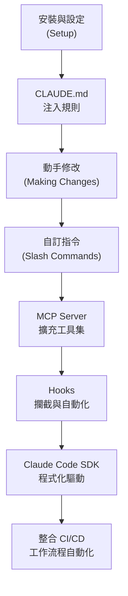

> 譯改寫自《Claude Code in Action》第 21 課

# 總結與下一步

> 📎 **本課資源**:[skilljar 原版課程頁(影片在此觀看,需登入)](https://anthropic.skilljar.com/claude-code-in-action/303238)

> **本課為純影片總結**，無逐字講義。這是 Anthropic 官方課程的收尾單元，重點在於回顧整門課程學到的技能，並指引後續的深化方向。

---

## 課程學了什麼

《Claude Code in Action》共 21 課，帶你從「[[claude-code]] 是什麼」一路走到「深度客製化」：

### 第一章：認識 Claude Code

- [[claude-code]] 是 Anthropic 推出的 AI 程式設計 CLI 工具，直接在終端機與 Claude 互動。
- 與一般聊天 Claude 的差異：可讀取本地檔案、執行指令、呼叫外部工具。

### 第二章：動手實作

- 安裝設定、專案初始化（`/init` 自動生成 [[claude-md]]）。
- 用 [[claude-code]] 進行實際程式碼修改：讀取 → 修改 → 測試的完整循環。

### 第三章：控制上下文

- 透過 [[claude-md]] 注入長期規則（語言偏好、編碼規範、禁止行為）。
- [[slash-command]] 自訂指令：在 `.claude/commands/` 放 `.md` 檔，用 `/名稱` 呼叫。
- [[mcp-server]] 整合外部工具（如 GitHub、資料庫、自訂 API），擴充 Claude 的工具集。

### 第四章：Hooks 與 SDK

- [[hook]] 攔截工具呼叫：[[pre-tool-use]] 可阻止危險操作；[[post-tool-use]] 可自動跑格式化或測試。
- [[sdk]] 讓你在程式裡用程式碼驅動 Claude Code，適合建立自動化工作流程或 CI 管線。

---

## 技能地圖



---

## 下一步：深化方向

### 1. 強化 `CLAUDE.md`

把你的開發規範、常見坑點、禁止操作全部寫進 [[claude-md]]。這是讓 Claude 「認識你的專案」最直接的方式。

### 2. 累積自訂 [[slash-command]]

把你重複做的事（如「產生測試」「寫 PR 說明」「資安掃描」）變成 `.claude/commands/` 下的指令，一鍵觸發。

### 3. 掛載 [[mcp-server]]

官方 MCP server 清單（GitHub、Google Drive、Slack 等）持續增加；也可用 MCP SDK 自行開發，接進任何內部系統。

### 4. 善用 [[hook]] 做防護網

在 [[pre-tool-use]] 加入白名單／黑名單邏輯；在 [[post-tool-use]] 加格式化、型別檢查，讓 Claude 的每次操作都有品質把關。

### 5. 用 [[sdk]] 建自動化工作流程

用 `@anthropic-ai/claude-code` 的 Node/Python SDK，把 Claude Code 嵌入 CI pipeline、批次任務或 GitHub Actions，無需人工介入。

---

## 一句話記住核心理念

> Claude Code 不只是「聊天補全程式碼」——它是一個**可程式化的 AI 協作者**，你透過 [[claude-md]]、[[slash-command]]、[[mcp-server]]、[[hook]]、[[sdk]] 五道旋鈕，決定它怎麼工作、存取什麼、自動做什麼。

---

## 在本座艙怎麼上這課

> ℹ️ 原版總結影片鎖在 skilljar（見上方「本課資源」連結，需登入），不看不影響。

這課最有價值的用法是**總複習**，在聊天面板跟教練說：

1. 「**幫我做全課程總複習**」——教練會用知識圖譜（`traverse_graph`）把 Hooks、MCP、上下文管理各主題走一遍，抽考你快忘掉的節點。
2. 「**考我 20 課的測驗**」——回到第 20 課做綜合測驗。
3. 想延伸應用，直接問「我想在自己的專案設定 ___，怎麼開始？」

---

```glossary
{
  "claude-code": {
    "term": "Claude Code",
    "short": "Anthropic 推出的 AI 程式設計 CLI 工具，可直接在終端機與 Claude 互動，並操作本地檔案與執行命令。",
    "deeper": "Claude Code 和在 claude.ai 網頁聊天的差異是什麼？它多了哪些能力？"
  },
  "claude-md": {
    "term": "CLAUDE.md",
    "short": "放在專案根目錄（或 ~/.claude/）的 Markdown 檔，Claude Code 每次啟動都會自動讀取，用來注入長期規則、偏好與專案背景。",
    "deeper": "CLAUDE.md 可以放在哪些層級？各層級的優先順序為何？"
  },
  "slash-command": {
    "term": "Slash Command（斜線指令）",
    "short": "在 Claude Code 對話中輸入 `/` 開頭的指令。自訂指令放在 `.claude/commands/*.md`，可封裝常用流程一鍵觸發。",
    "deeper": "如何建立一個自訂的 /review 指令來自動做 PR 審查？"
  },
  "mcp-server": {
    "term": "MCP Server（模型上下文協定伺服器）",
    "short": "透過 Model Context Protocol 接入 Claude 的外部服務，例如 GitHub、資料庫或自訂 API，讓 Claude 能呼叫這些工具。",
    "deeper": "MCP Server 和普通 API 呼叫有什麼差異？為什麼需要 MCP？"
  },
  "hook": {
    "term": "Hook（鉤子）",
    "short": "在 Claude Code 執行工具的前後插入自訂命令的機制。分為 [[pre-tool-use]]（執行前）和 [[post-tool-use]]（執行後）兩類。",
    "deeper": "Hook 的設定寫在 settings.json 的哪個層級？"
  },
  "pre-tool-use": {
    "term": "PreToolUse Hook",
    "short": "工具執行**前**觸發，可選擇放行或阻止操作，並向 Claude 回傳錯誤訊息。適合做存取控制或危險操作攔截。",
    "deeper": "PreToolUse 回傳什麼才能阻止工具執行？"
  },
  "post-tool-use": {
    "term": "PostToolUse Hook",
    "short": "工具執行**後**觸發，無法阻止執行，但可把額外反饋（如格式化結果、測試輸出）送回給 Claude。",
    "deeper": "PostToolUse 最適合做哪類自動化？"
  },
  "sdk": {
    "term": "Claude Code SDK",
    "short": "用程式碼驅動 Claude Code 的函式庫（Node/Python），可把 Claude Code 嵌入 CI pipeline、批次任務或 GitHub Actions。",
    "deeper": "SDK 和直接在終端機跑 Claude Code 有什麼差異？什麼情境下要用 SDK？"
  }
}
```
